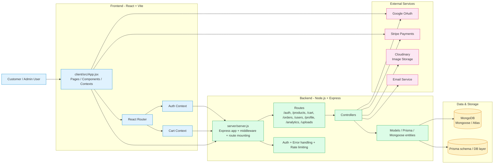

# Ecommerce App Architecture Overview

This application is structured as a full-stack e-commerce platform with a React frontend, an Express API backend, and MongoDB persistence. The client interacts with the server through REST endpoints, while the backend integrates with external services for payments, media storage, and authentication.

## Main components

- Frontend: `client/` is a React single-page application built with Vite and React Router.
- Backend: `server/` is an Express API that exposes REST routes for authentication, products, carts, users, analytics, orders, uploads, and profiles.
- Database: MongoDB is the primary persistent store, with Mongoose used in the backend configuration and Prisma present for additional data access patterns.
- Media: Cloudinary handles uploaded product and user images.
- Payments: Stripe is integrated for checkout and payment-related flows.
- Auth: Google OAuth and JWT-based auth patterns are used across the client and API.

## Request flow

1. A user loads the React app and navigates through pages and protected routes.
2. The frontend sends HTTP requests to the Express API endpoints.
3. The API applies middleware such as CORS, rate limiting, cookie parsing, and authentication checks.
4. Controllers process the request and interact with MongoDB and any external service needed by the operation.
5. Responses are returned to the client, which updates the UI and user context.

## Repository layout

- `client/src/` — pages, components, contexts, hooks, services, and styling
- `server/routes/` — endpoints exposed by the API
- `server/controllers/` — business logic and request handlers
- `server/models/` — MongoDB data models
- `server/config/` — database, Cloudinary, upload, and environment configuration
- `server/server.js` — bootstrap for the API and route registration
