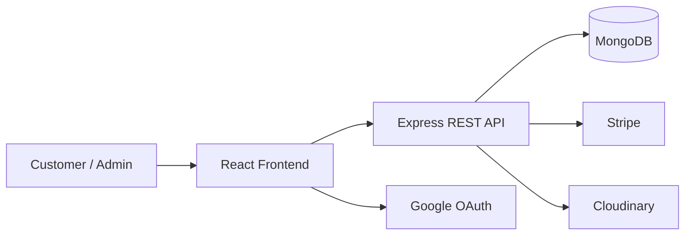

# VincyShop

VincyShop is a full-stack e-commerce platform built for a modern online shopping experience. Customers can browse products, manage their cart, place orders, complete payments, and track their purchases through a responsive web application.

The project combines a React frontend with a Node.js and Express backend, MongoDB persistence, and integrations for authentication, payments, email, and media uploads.

## Live Services

- **Backend API:** https://ecommerce-app-1-pxaw.onrender.com/
- **Repository:** https://github.com/vinycodepro/ecommerce-app

## Features

- Product browsing and catalog management
- Shopping cart functionality
- User registration and authentication
- Google OAuth support
- User profiles and dashboards
- Order placement and order history
- Payment processing with Stripe
- Product and user image uploads with Cloudinary
- Analytics endpoints
- Email-service integration support
- Responsive user interface
- API security with Helmet, CORS, and rate limiting

## Technology Stack

### Frontend

- React 18
- Vite
- React Router
- Tailwind CSS
- Axios
- Framer Motion
- React Hook Form
- Chart.js
- Storybook

### Backend

- Node.js
- Express
- MongoDB
- Mongoose
- Prisma
- JSON Web Tokens
- Stripe
- Cloudinary
- Nodemailer
- Socket.IO

### Development and Deployment

- Docker
- Docker Compose
- Vercel
- Render

## Architecture



The frontend communicates with the backend through REST APIs. The backend handles authentication, products, carts, users, profiles, analytics, orders, and uploads while connecting to MongoDB and external services when required.

## Project Structure

```text
ecommerce-app/
├── client/                 # React and Vite frontend
│   ├── public/
│   ├── src/
│   ├── .storybook/
│   ├── Dockerfile
│   ├── package.json
│   ├── vite.config.js
│   └── tailwind.config.js
│
├── server/                 # Node.js and Express backend
│   ├── config/              # Database and service configuration
│   ├── controllers/         # Request handlers and business logic
│   ├── middleware/          # Authentication and error handling
│   ├── models/              # Database models
│   ├── prisma/              # Prisma configuration and schema files
│   ├── routes/              # REST API routes
│   ├── scripts/             # Utility and seed scripts
│   ├── utils/               # Shared backend utilities
│   ├── server.js            # API entry point
│   ├── Dockerfile
│   └── package.json
│
├── docker-compose.yml
├── ARCHITECTURE.md
├── README.md
├── .gitignore
└── .dockerignore
```

## Prerequisites

- Node.js 18 or later
- npm
- MongoDB or a MongoDB Atlas database
- Stripe account for payment features
- Cloudinary account for image uploads
- Google OAuth credentials if Google authentication is enabled

## Installation

Clone the repository:

```bash
git clone https://github.com/vinycodepro/ecommerce-app.git
cd ecommerce-app
```

Install the frontend dependencies:

```bash
cd client
npm install
```

Install the backend dependencies:

```bash
cd ../server
npm install
```

## Environment Configuration

Create a `.env` file inside the `server/` directory. Use the variable names required by the enabled services in your local or deployment environment.

```env
PORT=5000
MONGO_URI=your_mongodb_connection_string
JWT_SECRET=your_jwt_secret

CLOUDINARY_CLOUD_NAME=your_cloudinary_cloud_name
CLOUDINARY_API_KEY=your_cloudinary_api_key
CLOUDINARY_API_SECRET=your_cloudinary_api_secret

STRIPE_SECRET_KEY=your_stripe_secret_key
GOOGLE_CLIENT_ID=your_google_client_id
GOOGLE_CLIENT_SECRET=your_google_client_secret
```

Never commit secrets or production credentials to the repository.

## Running Locally

Start the backend API:

```bash
cd server
npm run dev
```

Start the frontend in a separate terminal:

```bash
cd client
npm run dev
```

The local services are available at:

- Frontend: http://localhost:3000
- Backend API: http://localhost:5000

The deployed backend API is available at:

```text
https://ecommerce-app-1-pxaw.onrender.com/
```

## Docker

Run the frontend and backend services from the repository root:

```bash
docker-compose up --build
```

Stop the containers with:

```bash
docker-compose down
```

## Available Scripts

### Client

```bash
npm run dev
npm run build
npm run preview
npm run lint
npm run storybook
npm run build-storybook
```

### Server

```bash
npm run dev
npm start
npm run seed
```

## API Routes

The backend exposes the following route groups:

- `/api/auth` — authentication and account access
- `/api/products` — product operations
- `/api/cart` — shopping cart operations
- `/api/users` — user management
- `/api/profile` — profile operations
- `/api/analytics` — application analytics
- `/api/orders` — order management
- `/api/uploads` — image and file uploads

## Security

The backend includes security and reliability measures such as:

- Helmet security headers
- CORS configuration
- Request rate limiting
- Cookie parsing
- Input validation
- Centralized error handling
- Environment-based configuration

## Documentation

For a detailed technical overview, see [ARCHITECTURE.md](./ARCHITECTURE.md).

## License

This project currently has no license. All rights are reserved by the author.

## Author

**Vincyweb**

---

Built with React, Node.js, and Express for a scalable ecommerce experience.
